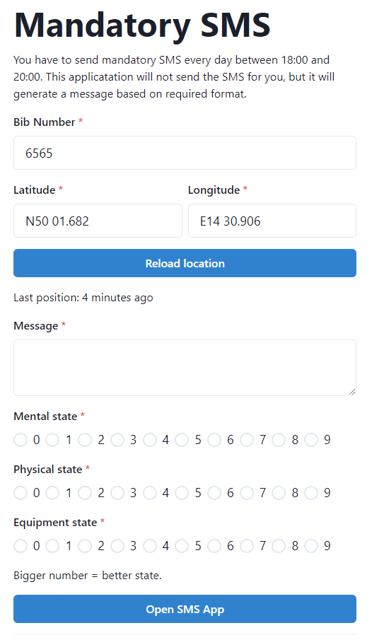

# 1000 Miles Adventure SMS app

This is web app for race [1000 Miles Adventure](https://www.1000miles.cz/) that makes process of sending mandatory SMS easier.

It uses browser Geolocation API to access location. App is written in React and uses Chakra for UI elements. It's build in vite and allows to save web for offline use.

There are tests written in @testing-library and run in vitest.

Types are check by typescript and formatting/rules by eslint.

